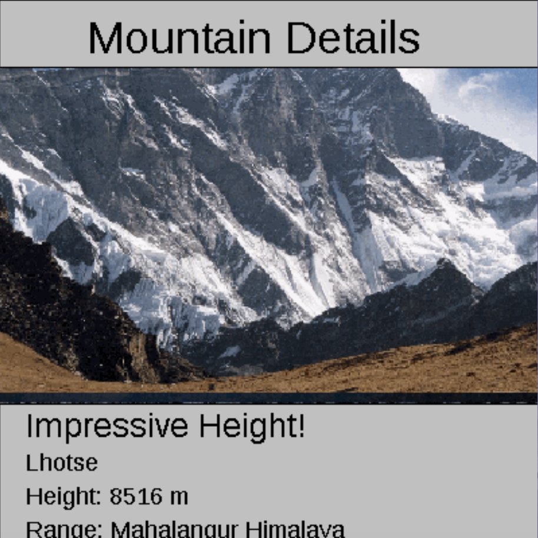

# Abstract-Data-Art-Project

# Unit 4 - Abstract Art Project

## Introduction

Data visualizations are powerful tools to present information and convey patterns and relationships. Sometimes visualizations are charts or graphs, and other times they are more abstract pieces of art. Your goal is to create a visual representation relating at least two categories from your dataset that engages your viewer and encourages them to learn more about your chosen topic.

## Dataset

The data for this project was generated by ChatGPT.

- **countries** (String) - name of the country where the mountain is
- **ranges** (String) - range of the mountains
- **heightInMeters** (double) - the height in meters for the mountains
-  **mountainNames** (String) - name of the mountains 
  

## UML Diagram

Put and image of your UML Diagram here. Upload the image of your UML Diagram to your repository, then use the Markdown syntax to insert your image here. Make sure your image file name is one work, otherwise it might not properly get display on this README.

## Video Demo

## Description

My project is a tool to show information about the tallest mountains in the world. It reads data from text files, like mountain names, heights, ranges, and countries. The program shows each mountain's details with visuals and images, making it engaging and educational. By organizing data into arrays and using data sets, the project simplifies the process of presenting the information for the visual. It’s designed to help users learn about mountains easily.
